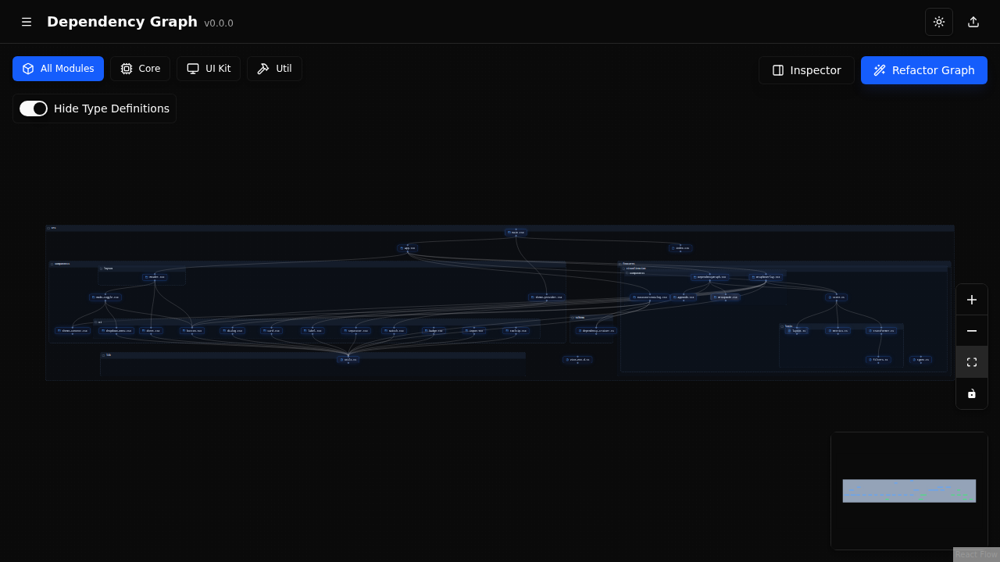
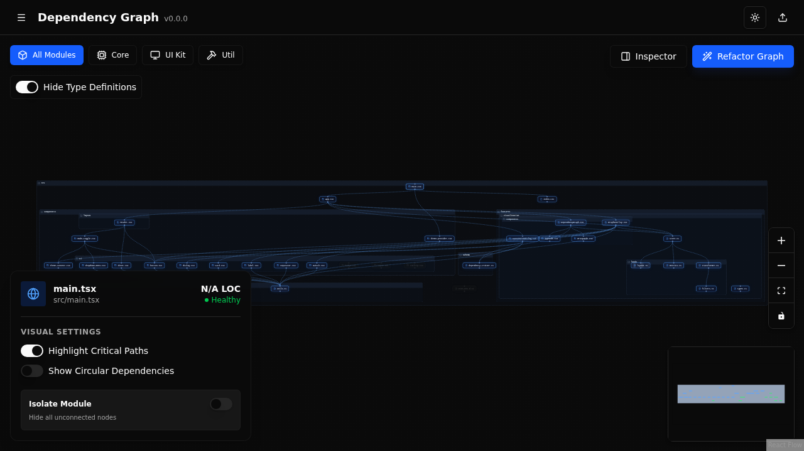
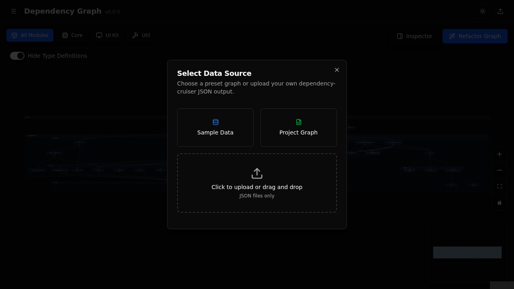

# Dependency Maritime ⚓️


**Chart, navigate, and refactor your application's architecture.**

Dependency Maritime is an interactive visualization tool for [dependency-cruiser](https://github.com/sverweij/dependency-cruiser). It transforms complex dependency graphs into navigable, interactive maps, helping you enforce boundaries, identify tangles, and plan refactoring efforts.

## 📸 Visuals

### Interactive Dashboard
Visualize your project's structure with an interactive graph. Zoom, pan, and filter to understand relationships.


### Node Inspector
Select any file to view detailed metrics, including incoming and outgoing dependencies.


### Bring Your Own Data
Easily upload your own `dependency-cruiser` JSON output to visualize your codebase.


## ✨ Features

*   **Interactive Visualization:** Zoom, pan, and drag nodes to explore your architecture.
*   **Deep Inspection:** Click any node to see its full path, metrics, and direct neighbors.
*   **Dependency Filtering:** Toggle between "Product" and "Test" code (planned) or specific folders.
*   **Isolate Modules:** Focus on specific sub-graphs to declutter the view.
*   **Metrics (Phase 2):** Analyze instability, centrality, and complexity metrics.
*   **100% Client-Side:** Your code structure is analyzed locally; no data leaves your machine.

## 🛠 Installation

1.  **Clone the repository:**
    ```bash
    git clone https://github.com/your-username/dependency-maritime.git
    cd dependency-maritime
    ```

2.  **Install dependencies:**
    ```bash
    npm install
    ```

3.  **Start the development server:**
    ```bash
    npm run dev
    ```

## 🚀 Usage

### 1. Generating a Dependency Graph
To visualize your own project, you need to generate a JSON report using `dependency-cruiser`.

Run the following command in the root of the project you want to analyze:

```bash
npx dependency-cruiser src \
  --include-only "^src" \
  --output-type json \
  > dependency-graph.json
```

*Adjust the `src` and `--include-only` patterns to match your project structure.*

### 2. Loading Data
1.  Open **Dependency Maritime** in your browser (default: `http://localhost:5173`).
2.  Click the **Upload** icon (cloud/arrow) in the header.
3.  Drag and drop your `dependency-graph.json` file or click to select it.
4.  The graph will automatically render your data.

## 🏗 Architecture & Phases

The project is being built in 4 phases:
1.  **Phase 1: The "Chartroom" (MVP)** - Core visualization (Complete).
2.  **Phase 2: The "Inspector"** - Metrics and health heatmaps (In Progress).
3.  **Phase 3: The "Simulator"** - Refactoring playground.
4.  **Phase 4: The "Cohesion" Assistant** - AI-assisted suggestions.

For more details, check out the documentation:
*   [Architecture](./docs/ARCHITECTURE.md)
*   [Phases & Roadmap](./docs/PHASES.md)
*   [Design Decisions](./docs/DESIGN_DECISIONS.md)

## 🤝 Contributing

This project uses **npm** for package management. Please ensure you lock files are updated accordingly.

1.  Fork the repo.
2.  Create a feature branch.
3.  Commit your changes.
4.  Push to the branch.
5.  Create a Pull Request.

## 📝 License

Distributed under the MIT License.
