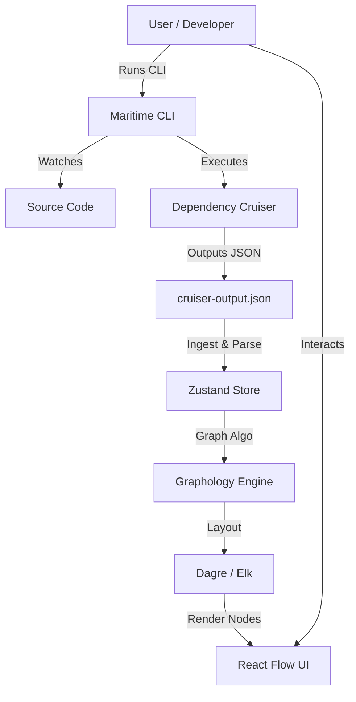

# Architecture

Dependency Maritime is designed as a high-performance, local-first engineering tool following the "Headless Logic, Interactive UI" pattern.

## High-Level Pattern

The heavy lifting of graph theory happens in a framework-agnostic logic layer, which feeds a React-based renderer.

> **Note:** This diagram represents the *target* architecture. Initial development phases will use a simpler data loading mechanism (e.g., loading a static JSON file directly) as noted in [Design Decisions](./DESIGN_DECISIONS.md).

## Tech Stack & Library Choices

| Component | Library Choice | Why this specifically? |
|---|---|---|
| **Runtime & Build** | Vite (React + TS) | Instant HMR is crucial when tweaking graph visuals. |
| **Language** | TypeScript | Strict typing is non-negotiable for parsing complex recursive dependency trees. |
| **State Management** | Zustand | Lightweight, capable of handling large objects (the graph) without unnecessary re-renders. |
| **Graph Visualization** | React Flow | Best-in-class for interactive, draggable nodes. Easier to customize than generic charting libs. |
| **Graph Algorithms** | Graphology | Headless graph library. Handles community detection, centrality, and pathfinding decoupled from the UI. |
| **Auto-Layout** | Dagre (or @reactflow/dagre) | You need an algorithm to organize the initial "spaghetti" into a hierarchical tree. |
| **Data Validation** | Zod | To validate the incoming dependency-cruiser JSON schema and ensure runtime safety. |
| **UI Components** | Shadcn/UI (Tailwind) | Clean, professional, copy-pasteable components. Fast to implement. |
